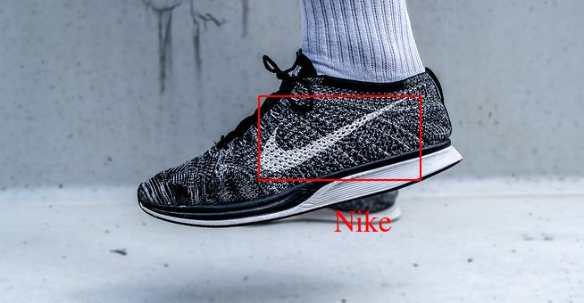
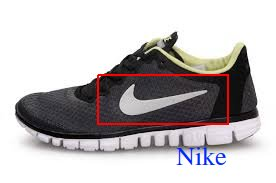

# Real time Object Detection using deep learning
This project demonstrates, how we can make use of tensorflow object detection api to detect cutom objects at real time.

Model Details:

==> For this task, i have used a pretrained SSD model with inceptionv2, and finetuned it to out target dataset. Since this is going to be a real time object detection we cannot comprimise on speed. As there is a trade off between speed and accuracy, we have to select the model depending up on our requirement. SSD is one of the best object detection architecture and is well known for its speed without trading much on the accuracy. This is the reason i went for a SSD architecture than a RCNN based model. 

==> Python script for evaluating the model on test video, is multithreaded so that the speed with which frames are processed is much better than original.

   

Reference: https://towardsdatascience.com/how-to-train-your-own-object-detector-with-tensorflows-object-detector-api-bec72ecfe1d9
